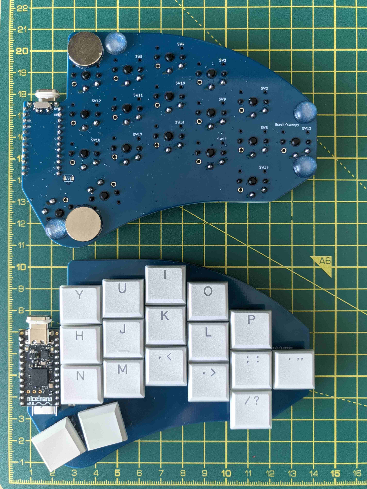

Sweepy keyboard
===============

Lineage
-------

`Ferris <https://github.com/pierrechevalier83/ferris>`_ 
--> `Sweep <https://github.com/davidphilipbarr/Sweep>`_ 
--> `Exkeylibur <https://github.com/tlietz/Exkeylibur>`_ (V1 Dagger)
--> Sweepy

Many thanks to the creators of the ancestor boards.

Motivation/Changes
------------------

It's basically a Ferris Sweep with an extra outer pinky key on each
side, and some extra pcb to flushly mount rubber feet and magnets to.

Sweepy is to Sweep as `Jorne <https://github.com/joric/jorne>`_ is to 
`Corne <https://github.com/foostan/crkbd>`_.

Firmware
--------

Can be found in my 
`zmk-config repo <https://github.com/jhauh/zmk-config>`_, along with a 
default keymap diagram.

